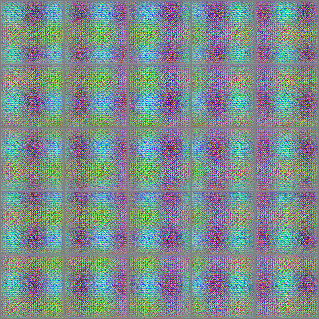
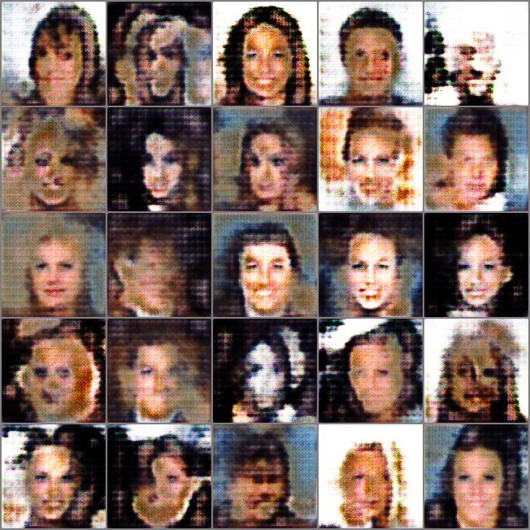
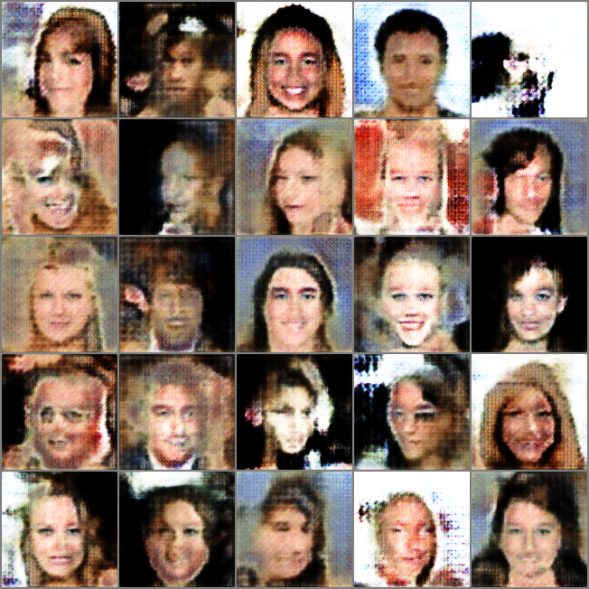
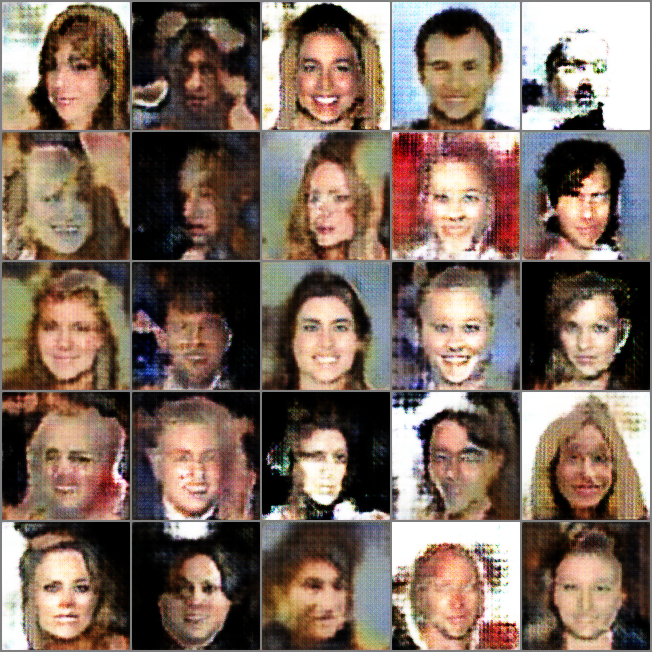
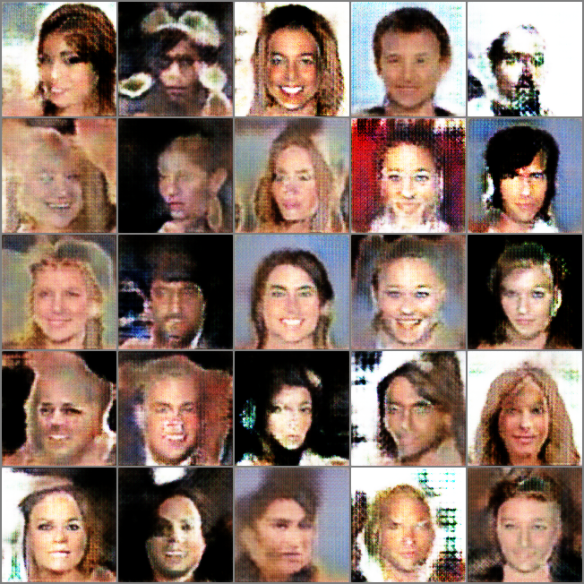

# Simple GAN implementations

Implementations of DCGAN and WGAN in PyTorch.

## Usage

Make sure you are already logged on to WandB, the scripts will create projects called "wgan_celeba" for you to track progress.

- Run `python -m mygan` to train a WGAN on CelebFaces.

## Samples

The table below displays samples generated from the same noise vectors at different epochs in training.

| 0               | 35                 | 75                 | 109                 | 135                 |
|-----------------|--------------------|--------------------|---------------------|---------------------|
|  |  |  |  |  |

You can see some cool samples [in this WandB report](https://wandb.ai/tetamusha/wgan_celeba/reports/GAN-training-on-image-datasets--Vmlldzo2NzMxODkx).

## References

- <https://pytorch.org/tutorials/beginner/dcgan_faces_tutorial.html>
- <https://lightning.ai/docs/pytorch/1.8.4/notebooks/lightning_examples/basic-gan.html>
- <https://www.udemy.com/course/generative-creative-ai-from-gans-to-clip-with-python-and-pytorch/>
